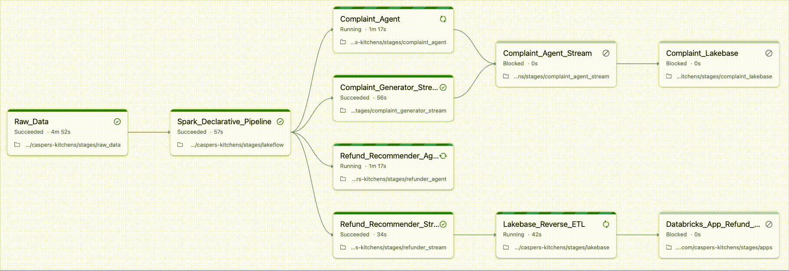

# 🍔 Casper's Kitchens

Casper's Kitchens is a ghost kitchen and food-delivery platform built entirely in Databricks by the Developer Relations team. It brings together Lakeflow (ingestion, Spark Declarative Pipelines), AI and BI dashboards with Genie, Agent Bricks, and Apps powered by Lakebase (Postgres): all stitched into one cohesive live demo.

Casper's isn't just a showcase. It's a playground for exploring, experimenting, and practicing a bit of creative misuse. We're pushing the platform past its comfort zone to see what's possible. Everything is designed to be easy to:

1. 🚀 **Deploy:** Just a couple of commands to spin up and tear down the entire environment in minutes.
2. 🎬 **Demo:** Run only the stages you need. Every component is powered by live, streaming data.
3. 🧑‍💻 **Develop:** add new pipelines, agents, or apps with minimal setup. Everything is built to extend.

By doing everything in a Databricks-native way, even when it doesn't make sense, Casper's becomes a shared sandbox for demos, onboarding, learning, and research. It's meant to be fun, fast, and fearless.

## Deploy

Casper's Kitchens uses Databricks Asset Bundles (DABs) to make deployment easy. To get started, clone this repository and run the following command from the root of the project:

```
databricks bundle deploy
```

This will create the main job, `Casper's Initializer`, that helps orchestrate the Casper's universe, and make all of Casper's assets available in your workspace at `/Workspace/Users/<youruser@email.com>/caspers-kitchens`. Databricks Asset Bundles will use your existing CLI configuration by default, to configure more targets and learn more about DABs see [databricks.yml](./databricks.yml) and [the documentation](https://docs.databricks.com/aws/en/dev-tools/bundles/#how-do-bundles-work)

You're ready to demo!

## Demo



Casper's is organized into tasks within the Casper's Initializer job. Each task handles a specific part of the system: data generation, pipelines, agents, apps, etc.

You can control which tasks to run [through the Databricks Jobs UI](https://docs.databricks.com/aws/en/jobs/run-now#run-a-job-with-different-settings) or using Databricks Asset Bundles (DABs) (examples below). For example, if you only need raw data, run the data generation task. If you want to include agents and apps, run the full chain of dependent tasks as shown in the DAG above.

The easiest way to control Casper's is using Databricks Jobs UI, but you can use DAB commands as shown below to control from the CLI.

### 1. Run the full demo (recommended)

To spin up the complete Casper's Kitchens environment as pictured above (executes every task in the DAG):

```bash
databricks bundle run caspers 
```

By default, this uses the catalog `caspersdev`. You can override this like:

```bash
databricks bundle run caspers --params "CATALOG=mycatalog"
```

Make sure you have permission to create catalogs, or that the specified catalog already exists. 

To shut down and cleanup all of Casper's assets:

```
databricks bundle run cleanup (--params "CATALOG=mycatalog")
databricks bundle destroy
```

### 2. Run individual stages

You can also run only specific stages of Casper's. Databricks Asset Bundles (`--only`) execute exactly the tasks you list, so if a stage depends on others, you'll need to include them too. To simplify this, load the helper that resolves dependencies automatically:

```bash
source <(python utils/resolve_tasks.py)
```

Once loaded, you can use the same task names with `$` to automatically include all dependencies (for example, `$Refund_Recommender_Agent` will also run `Spark_Declarative_Pipeline` and `Raw_Data`).

Please be aware that currently the **the tasks are not idempotent**, so run with care. When in doubt, destroy the environment, and re-run with the stage you want with the `$` prepended like below:

#### 📊 Raw Data

Generates a realistic stream of orders and GPS coordinates.

```bash
databricks bundle run caspers --only $Raw_Data
```

#### 🔄 Lakeflow (Spark Declarative Pipeline)

Processes and curates order data using a medallion architecture (Bronze → Silver → Gold tables).

```bash
databricks bundle run caspers --only $Spark_Declarative_Pipeline
```

#### 🤖 Refund Recommender Agent

Scores each delivery for refund eligibility.

```bash
databricks bundle run caspers --only $Refund_Recommender_Agent
```

#### ⚡ Refund Recommender Stream

Streams completed orders into the refund-scoring agent in real time.

```bash
databricks bundle run caspers --only $Refund_Recommender_Stream
```

#### 🔁 Lakebase Reverse ETL

Syncs refund-scored orders from the Lakehouse into Lakebase.

```bash
databricks bundle run caspers --only $Lakebase_Reverse_ETL
```

#### 📱 Refund Manager App

Launches a Databricks app for manual refund review and approval.

```bash
databricks bundle run caspers --only $Databricks_App_Refund_Manager
```

#### 💬 Complaint Agent

LLM agent that classifies and responds to customer complaints.

```bash
databricks bundle run caspers --only $Complaint_Agent
```

#### 🌊 Complaint Generator Stream

Simulates a live stream of customer complaint events.

```bash
databricks bundle run caspers --only $Complaint_Generator_Stream
```

#### ⚙️ Complaint Agent Stream

Runs the complaint-handling agent continuously on live events.

```bash
databricks bundle run caspers --only $Complaint_Agent_Stream
```

#### 🗄️ Complaint Lakebase

Stores complaint data in Lakebase (Postgres) for downstream use.

```bash
databricks bundle run caspers --only $Complaint_Lakebase
```

## 📊 Generated Event Types

The data generator produces the following realistic events for each order in the Volume `caspers.simulator.events`:

| Event | Description | Data Included |
|-------|-------------|---------------|
| `order_created` | Customer places order | Customer location (lat/lon), delivery address, ordered items with quantities |
| `gk_started` | Kitchen begins preparing food | Timestamp when prep begins |
| `gk_finished` | Kitchen completes food preparation | Timestamp when food is ready |
| `gk_ready` | Order ready for pickup | Timestamp when driver can collect |
| `driver_arrived` | Driver arrives at kitchen | Timestamp of driver arrival |
| `driver_picked_up` | Driver collects order | Full GPS route to customer, estimated delivery time |
| `driver_ping` | Driver location updates during delivery | Current GPS coordinates, delivery progress percentage |
| `delivered` | Order delivered to customer | Final delivery location coordinates |

Each event includes order ID, sequence number, timestamp, and location context. The system models realistic timing between events based on configurable service times, kitchen capacity, and real road network routing via OpenStreetMap data.

## 🎯 Use Cases

- **📚 Learning Databricks**: Complete end-to-end platform experience
- **🎓 Teaching**: Consistent narrative across different Databricks features  
- **🧪 CUJ Testing**: Run critical user journeys in realistic environment
- **🎨 UX Prototyping**: Fully loaded platform for design iteration
- **🎬 Demo Creation**: Unified narrative for new feature demonstrations

## 🙌 Why This Matters

Most demos show just one slice of Databricks. Casper's Kitchens shows how it all connects: ingestion, curation, analytics, and AI apps working together. Use it to learn, demo to customers, or build your own extensions.

## License

© 2025 Databricks, Inc. All rights reserved. The source in this notebook is provided subject to the Databricks License [https://databricks.com/db-license-source]. All included or referenced third party libraries are subject to the licenses set forth below.

| library                                | description             | license    | source                                              |
|----------------------------------------|-------------------------|------------|-----------------------------------------------------|
