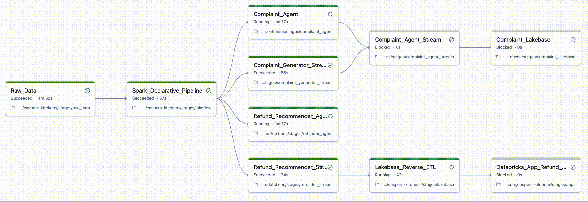

 

# Casper's Kitchens

A "demo" consumer brand built by the Developer Relations team to showcase the full Databricks platform. First imagined as a ghost kitchen and delivery service, the evolved concept can flex across multiple verticals. Casper's integrates every layer — Lakeflow, AI/BI, Genie, Agent Bricks, Apps, and Lakebase — into a unified live demo.

## Build Your Own

Want a demo for a different business? The **Caspers skill** generates streaming data, GPS routing, and replay engines for any domain:

```bash
git clone -b skill https://github.com/databricks-solutions/caspers-kitchens.git caspers-skill
```

See the [`skill` branch](../../tree/skill) for details.

## Prerequisites

- Databricks CLI installed and authenticated (`databricks auth login`)
- Workspace permissions to create catalogs

## Deploy

```bash
databricks bundle deploy -t <target>
```

Each **target** represents a different flavor of Casper's (for example, full demo, complaints-only, free tier, etc.).
Use whichever fits your needs:

```bash
databricks bundle deploy -t default     # full version: Data generation, Lakeflow, Agents, Lakebase & Apps
databricks bundle deploy -t complaints  # complaints agent: Data generation, Lakeflow, Agents, Lakebase
databricks bundle deploy -t free        # Databricks Free Edition: Data generation, Lakeflow
databricks bundle deploy -t menus       # document intelligence: Menu & inspection PDFs, DLT pipeline, Genie, Knowledge Assistants, Multi-Agent Supervisor
databricks bundle deploy -t game        # Casper's quest 
```

This creates the main job **Casper's Initializer**, which orchestrates the full ecosystem, and places all assets in your workspace under
`/Workspace/Users/<your.email@databricks.com>/caspers-kitchens-demo`.

> 💡 You can also deploy from the Databricks UI by cloning this repo as a [Git-based folder](https://docs.databricks.com/repos/) and clicking [Deploy Bundle](https://docs.databricks.com/aws/en/dev-tools/bundles/workspace-tutorial#deploy-the-bundle).

For more about how bundles and targets work, see [databricks.yml](./databricks.yml) or the [Databricks Bundles docs](https://docs.databricks.com/en/dev-tools/bundles/index.html).

### menus target

The `menus` target deploys a document intelligence pipeline showcasing PDF processing, a bronze/silver/gold DLT pipeline, and a multi-agent supervisor:

| Stage | What it does |
|-------|-------------|
| **Menu_Data** | Uploads 16 restaurant menu PDFs and structured metadata to Unity Catalog |
| **Inspection_Data** | Uploads 12 food safety inspection report PDFs and metadata to Unity Catalog |
| **Menu_Pipeline** | DLT pipeline (bronze/silver/gold) with data quality expectations over menu and inspection data |
| **Menu_Genie** | Genie space for natural language SQL queries over 10 silver + gold tables |
| **Menu_Knowledge_Agent** | Knowledge Assistant for document Q&A over menu PDFs |
| **Inspection_Knowledge_Agent** | Knowledge Assistant for document Q&A over inspection report PDFs |
| **Menu_Supervisor** | Multi-Agent Supervisor coordinating Genie, Menu KA, and Inspection KA |

See [demos/multi-agent-supervisor/README.md](./demos/multi-agent-supervisor/README.md) for a guided demo flow with sample questions.

## Run the Demo



Once deployed, run **any** target with the same command:

```bash
databricks bundle run caspers
```

Available targets:

| Target | What it deploys |
|--------|----------------|
| `default` | Data generation, Lakeflow pipeline, refund agent, Lakebase + app |
| `support` | Data generation, Lakeflow pipeline, support triage agent, Lakebase + app |
| `complaints` | Data generation, Lakeflow pipeline, complaint agent, Lakebase |
| `free` | Data generation, Lakeflow pipeline (Free Edition compatible) |
| `menus` | Document intelligence, DLT pipeline, Genie, Knowledge Assistants, Multi-Agent Supervisor |
| `game` | Casper's quest |

Optionally specify a catalog (default: `caspersdev`):

```bash
databricks bundle run caspers --params "CATALOG=mycatalog"
```

## Clean Up

```bash
# Option 1: Wrapper script (recommended)
./cleanup.sh mycatalog

# Option 2: Environment variable (--var is not passed to the cleanup script by the CLI)
BUNDLE_VAR_catalog=mycatalog databricks bundle run cleanup

databricks bundle destroy
```

## Blog

Check out the [Casper's Kitchens Blog](https://databricks-solutions.github.io/caspers-kitchens/).

## License

© 2025 Databricks, Inc. All rights reserved. The source in this notebook is provided subject to the Databricks License [https://databricks.com/db-license-source]. All included or referenced third party libraries are subject to the licenses set forth below.

| library                                | description             | license    | source                                              |
|----------------------------------------|-------------------------|------------|-----------------------------------------------------|
