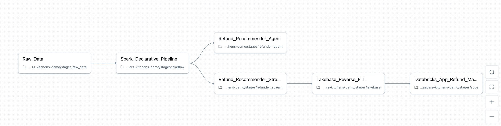

We've implemented Databricks Asset Bundles (DABs) to make it easier to deploy and run the Casper’s universe. Now, instead of running init and destroy notebooks manually, you can use asset bundle commands using the Databricks CLI like this:

```
databricks bundle deploy
databricks bundle run caspers

databricks bundle run cleanup
databricks bundle destroy
```

We’ve also leveraged the high level target mappings to deploy different versions of the Casper’s environment like so:

```
databricks bundle deploy -t default
databricks bundle deploy -t complaints
databricks bundle deploy -t free
databricks bundle deploy -t all
```

The [examples in the documentation](https://docs.databricks.com/aws/en/dev-tools/bundles/settings#default) show targets being used for environment mapping like `dev`, `staging`, `prod`, etc., which is common and expected, but our use highlights that targets are, in the end, arbitrary high level labels that can contain other high level mappings like `workspace`, `artifacts`, and `resources`.  In our case, we provide different resources definition per target in order to define the main job that controls our environment, Casper’s Initializer. 

For example, our canonical Casper’s environment (`databricks bundle deploy -t default`) looks like this:



You can see that the default Casper's stack has tasks to handle deployment of:

- Data generation job
- A medallion-style Spark Declarative Pipeline
- An agent that suggests refunds
- A streaming pipeline applying that agent to live orders in real time
- An app for human-in-the-loop refund approval

While our Free Edition environment (`databricks bundle deploy -t default`) looks like this:


Which today (but not for long!) includes only the data generation and medallion style Spark Decalarative Pipeline. 

Now, if you look closely at the tasks in these job definitions, you might wonder why we have this job at all. Can’t we define all this Databricks infrastructure in the DAB _also_?

**Yes…** at least mostly.

Things like notebooks, jobs, declarative pipelines, models, databases, apps… [all of these can be defined in asset bundles](https://docs.databricks.com/aws/en/dev-tools/bundles/resources#resource-types), and for a production system, your production system, it’d be wise to push DABs as far as they’ll go. DABs

But Casper’s is [a demo universe](https://github.com/databricks-solutions/caspers-kitchens) designed to touch as much of the Databricks product surface area as possible. And since we already rely on DABs as the high-level controller of that universe, we’re happy to stop there, and start exploiting Databricks’ orchestration features with Jobs.

The Jobs UI gives us a beautiful, visual DAG representing the entire Casper’s universe out of the box. We can toggle demo stages on and off and highlight other platform features: conditional tasks, dependencies, parallel flows, deployment history, etc. in a way that’s intuitive both for us and a potential audience.

For example, if we want to demo only up until our medallion architecture, we can use the UI to select and run only those tasks, and only move downstream if needed later:

<video controls autoplay loop>
  <source src="../assets/images/20251114-databricks-asset-bundles-and-jobs/tasks.mov" type="video/mp4">
</video>

The end result is our universe has a simple two layer orchestration pattern:

- **Layer 1:** DABs define what exists.
The bundle decides which resources, notebooks, parameters, and job definitions belong in the environment, and which target should be deployed.

- **Layer 2:** Jobs decide how it runs.
The Jobs UI becomes our control center: a visual map of the pipelines, agents, and apps that make up the Casper’s universe. It lets us toggle subsystems, demo conditional logic, and walk through the architecture in real time.

We also take advantage of DABs for operational tasks like cleanup. Instead of defining a permanent cleanup job, we use a [scripts](https://github.com/databricks-solutions/caspers-kitchens/blob/main/databricks.yml#L26C1-L62C57) block in the bundle to launch an ephemeral cleanup run using the Jobs Submit API. The script resolves the active target, extracts the correct workspace paths and catalog, and submits a one-off job that executes our destroy notebook with the right parameters. We also get to reuse our original `destroy.ipynb` notebook this way, so the execution path is unified.

To summarize, this two layer DABs + Jobs approach gives us sufficient breathing room to move either way in the future. Casper’s mission is to explore Databricks in creative, if slightly unconventional ways, so using Jobs as our orchestration console, even when DABs could do parts of it, is a deliberate choice that helps us teach, demo, and experiment more effectively.
