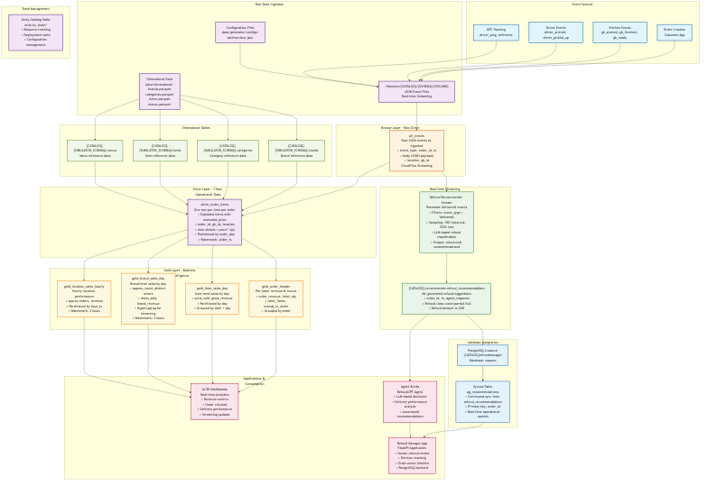

# Casper's Kitchens - Dataflow Architecture Diagram

## Overview

This document provides a comprehensive view of the Casper's Kitchens data architecture, showing how data flows from ghost kitchen operations through the medallion architecture to applications and dashboards.

## Visual Dataflow Diagram



*Complete dataflow architecture showing event sources, medallion layers, streaming intelligence, and applications*

> **Note**: For high-resolution version suitable for presentations, see [dataflow-diagram-hd.png](./images/dataflow-diagram-hd.png). Vector version available as [dataflow-diagram.svg](./images/dataflow-diagram.svg).

## Architecture Layers

### Event Sources Layer
The system ingests real-time events from ghost kitchen operations:

- **Order Creation**: Customer app generates order events
- **Kitchen Events**: Cooking status updates (started, finished, ready)  
- **Driver Events**: Pickup, delivery, and GPS tracking events
- **GPS Tracking**: Real-time location updates during delivery

### Raw Data Ingestion Layer
Events are captured and stored in raw format:

- **Volume Storage**: `/Volumes/{CATALOG}/{SCHEMA}/{VOLUME}`
- **Event Types**: 7 distinct event types covering full order lifecycle
- **Format**: JSON files streamed via CloudFiles
- **Frequency**: Real-time streaming with configurable batch processing

### Bronze Layer - Raw Event Store
Raw events are ingested into the lakehouse:

```sql
-- Table: all_events
-- Purpose: Raw JSON events as ingested (one file per event)
-- Source: CloudFiles streaming from volumes
-- Schema: Raw JSON with event metadata
```

**Key Fields**:
- `event_type`: Type of event (order_created, gk_started, etc.)
- `order_id`: Unique order identifier
- `ts`: Event timestamp
- `body`: JSON payload with event-specific data
- `location`: Ghost kitchen location
- `gk_id`: Ghost kitchen identifier

### Silver Layer - Clean Operational Data
Events are processed and normalized:

```sql
-- Table: silver_order_items
-- Purpose: One row per item per order, with extended_price
-- Partitioned by: order_day
-- Processing: Explodes order items, adds calculated fields
```

**Key Transformations**:
- Explode order items from arrays
- Calculate `extended_price = price * qty`
- Parse customer location data
- Add temporal partitioning
- Enforce data types and schemas

**Key Fields**:
- `order_id`, `gk_id`, `location`
- `order_ts`: Canonical event timestamp
- `item_id`, `menu_id`, `category_id`, `brand_id`
- `item_name`, `price`, `qty`, `extended_price`
- `order_day`: Partition key

### Gold Layer - Business Intelligence
Aggregated tables for analytics and reporting:

#### gold_order_header
```sql
-- Purpose: Per-order revenue & counts
-- Aggregation: Group by order
-- Metrics: Total revenue, item counts, brand diversity
```

#### gold_item_sales_day  
```sql
-- Purpose: Item-level units & revenue by day
-- Partitioned by: day
-- Metrics: Units sold, gross revenue per item
```

#### gold_brand_sales_day
```sql
-- Purpose: Brand-level orders (approx), items, revenue by day  
-- Partitioned by: day
-- Processing: Stream-safe with HyperLogLog for order counting
-- Watermark: 3 hours for late-arriving data
```

#### gold_location_sales_hourly
```sql
-- Purpose: Hourly orders (approx) & revenue per location
-- Partitioned by: hour_ts
-- Frequency: Real-time with 3-hour watermark
-- Metrics: Approximate order counts, revenue by location/hour
```

### Dimensional Data
Static reference data loaded from parquet files:

- **brands.parquet** → `{CATALOG}.{SIMULATOR_SCHEMA}.brands`
- **categories.parquet** → `{CATALOG}.{SIMULATOR_SCHEMA}.categories`  
- **items.parquet** → `{CATALOG}.{SIMULATOR_SCHEMA}.items`
- **menus.parquet** → `{CATALOG}.{SIMULATOR_SCHEMA}.menus`

### Real-time Streaming Intelligence

#### Refund Recommender Stream
```sql
-- Source: {CATALOG}.lakeflow.all_events
-- Filter: event_type = 'delivered'
-- Processing: ML-based refund scoring using LLM
-- Output: {CATALOG}.recommender.refund_recommendations
```

**Processing Logic**:
- Filters delivered orders
- Applies sampling (10% historical, 100% new data)
- Calls LLM agent for refund classification
- Outputs structured recommendations

### Lakebase Integration
PostgreSQL instance for operational applications:

- **Instance**: `{CATALOG}refundmanager`
- **Database**: `caspers`
- **Synced Table**: `pg_recommendations`
- **Sync Policy**: Continuous from `refund_recommendations`
- **Primary Key**: `order_id`

### Applications Layer

#### Refund Manager App
FastAPI application for human review:

- **Database**: PostgreSQL via Lakebase
- **Tables**: 
  - `refunds.refund_decisions` (decisions made by humans)
  - `recommender.pg_recommendations` (AI recommendations)
- **Features**: 
  - View AI recommendations
  - Apply refund decisions
  - Track decision history
  - Order event timeline

#### AI/BI Dashboards
Real-time analytics and monitoring:

- **Data Sources**: Gold layer tables
- **Metrics**: Revenue, order volumes, delivery performance
- **Refresh**: Real-time streaming updates

#### Agent Bricks
AI-powered refund decision agent:

- **Model**: LLM-based classification
- **Input**: Order delivery performance data
- **Output**: Refund recommendations (none/partial/full)
- **Integration**: Embedded in streaming pipeline

## Data Flow Summary

```
Event Sources → Raw Volume → Bronze (all_events) → Silver (silver_order_items) → Gold Tables
                                                                                      ↓
Dimensional Data ────────────────────────────────────────────────────────────→ Applications
                                                                                      ↓
Streaming Intelligence ←─────────────────────────────────────────────────────→ Lakebase
```

## Key Technical Details

### Streaming Configuration
- **Watermarks**: 3 hours for late-arriving data
- **Checkpointing**: Managed by Delta Live Tables
- **Partitioning**: By date/hour for optimal query performance
- **Approximate Aggregations**: HyperLogLog for stream-safe distinct counts

### Data Quality
- **Schema Enforcement**: Structured schemas for all silver/gold tables
- **Data Validation**: Check constraints on critical fields
- **Error Handling**: Robust JSON parsing with fallback values

### Scalability
- **Partitioning Strategy**: Time-based partitioning for all fact tables
- **Streaming**: Auto-scaling with Delta Live Tables
- **Storage**: Delta format with optimized file sizes

## Developer Onboarding

### Key Files to Understand
1. `pipelines/order_items/transformations/transformation.py` - Core data transformations
2. `stages/raw_data.ipynb` - Data generation and ingestion setup
3. `stages/lakeflow.ipynb` - Pipeline orchestration
4. `apps/refund-manager/app/main.py` - Application layer

### Getting Started
1. Review the event types and their schemas in the README
2. Understand the medallion architecture layers
3. Examine the transformation logic in `transformation.py`
4. Explore the streaming components and applications
5. Run the demo using the "Casper's Initializer" job

### Common Queries
```sql
-- View recent orders
SELECT * FROM {CATALOG}.lakeflow.silver_order_items 
WHERE order_day >= CURRENT_DATE - 1;

-- Check gold layer metrics
SELECT * FROM {CATALOG}.lakeflow.gold_brand_sales_day 
WHERE day = CURRENT_DATE;

-- Monitor streaming health
DESCRIBE HISTORY {CATALOG}.lakeflow.all_events;
```
